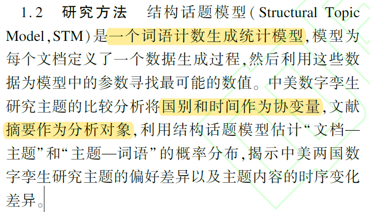
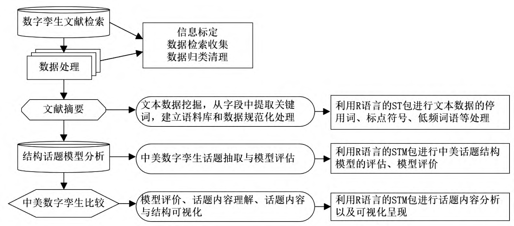
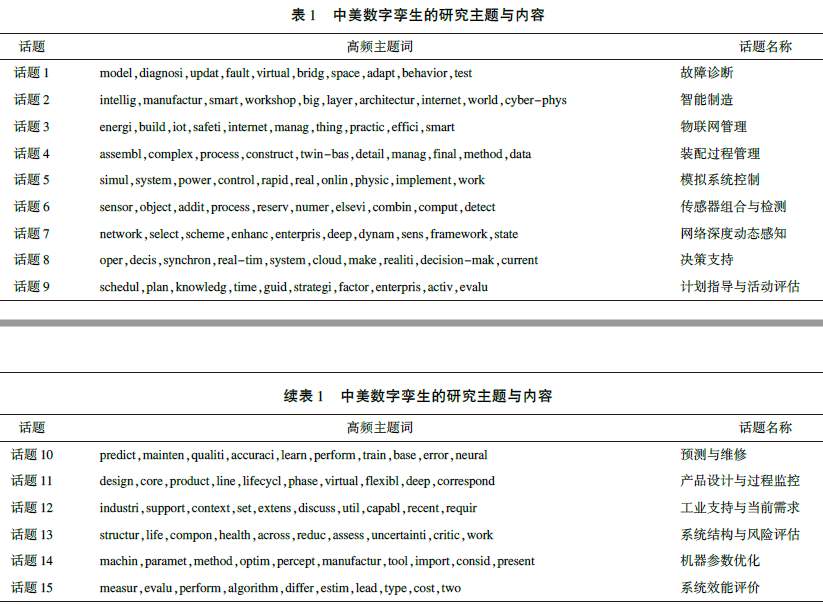

# 2021-情报杂志

《中美数字孪生研究主题的比较分析——兼论基于结构话题模型的文献主题数据挖掘方法》

研究内容：中美“数字孪生”的比较分析

数据：文献检索以“digital twin”为主题词，时间跨度为所有年份，核心合集选择SSCI 和SCI 这两个引文索引数据库，检索日期为2021 年4 月18 日。排除非研究性文章、非英语文献类型以及信息残缺的文献后，最终中国有144 篇文献，美国有57 篇文献。

方法：

路线：

结论：

重要意义：

