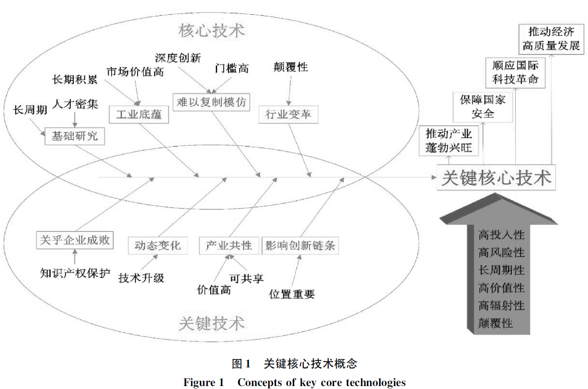
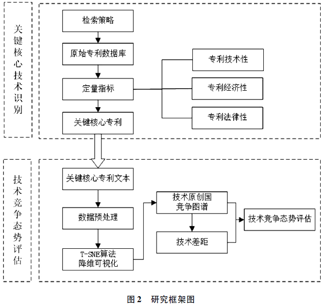

# 读论文

《关键核心技术竞争态势评估研究》-郑思佳

> 0 引言

国家间的竞争就是科技的竞争，引用文献来阐述科技创新的重要性。

描述我们在关键核心技术领域的不足，当前研究的重点应该是什么？意义是什么？

本文通过专利技术的识别，明确我们技术竞争态势，点题。

*典型的三段式写法*

> 1 研究现状

先明确**关键核心技术的技术属性和内涵特征**

引出高质量专利是关键核心技术的体现，即关键核心技术识别=识别关键核心专利。

关键核心专利的识别有**四个方法**：单一指标识别法、指标组合法、指标体系识别法、社会网络分析方法。

技术竞争态势评估：技术发展趋势（时序分析、技术演变）、竞争主体识别（竞争对手、申请人）、技术竞争区域分析、技术竞争领域分析；

> 研究设计

关键指标：专利技术性、经济性、法律性

> 实证分析-集成电路

IPC分类号与关键词结合进行检索数据。

专利数据源：汤森路透的世界专利引文索引（DWPI），检索得到3930726条数据。

指标筛选后有13116件关键核心专利。

